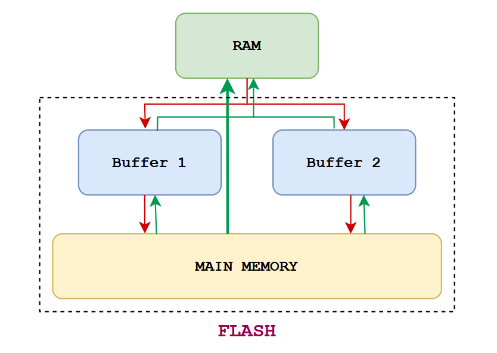

# Hướng dẫn sử dụng driver AT45DB161D

  

### Khởi tạo flash
~~~c
void AT45DB161_Init(void).
~~~
CS luôn phải ở mức cao trong khoảng thời gian chip vừa bật/reset.

### Ghi dữ liệu (RAM → FLASH)
Flash AT45DB161D không cho phép ghi trực tiếp từ RAM vào Flash, mà phải thông qua 2 bộ đệm Buffer 1 và Buffer 2.

Quy trình ghi:
- 1. RAM →  buffer
~~~c
void AT45DB161_WriteBuffer(uint8_t BufferNum, uint8_t *SrcBuffer, uint16_t BufferAddr, uint16_t NumByteToWrite);
~~~

- 2. Buffer → Page vật lý
~~~c
void AT45DB161_Buf_To_Mm_WithErase(uint8_t BufferNum, uint16_t PageAddr);
~~~

> Sau hai bước này, dữ liệu từ RAM sẽ được ghi vào Flash.

### Đọc dữ liệu (Flash → RAM)

#### Cách 1: Đọc trực tiếp từ Main Memory
~~~c
void AT45DB161_PageRead(uint8_t *Buffer, uint16_t PageAddr, uint16_t NumByteToRead);
~~~

#### Cách 2: Đọc qua Buffer
- 1. Main Memory → Buffer
~~~c
void AT45DB161_Mm_To_Buf(uint8_t BufferNum, uint16_t PageAddr);
~~~

- 2. Buffer → RAM
~~~c
void AT45DB161_ReadBuffer(uint8_t BufferNum, uint8_t *Buffer, uint16_t ReadAddr, uint16_t NumByteToRead);
~~~

### Status của flash

#### Giá trị của thanh ghi status
~~~c
uint8_t  AT45DB161_GetStateReg(void);  
~~~

#### Kiểm tra Flash sẵn sàng nhận lệnh mới
~~~c
bool AT45DB161_WaitReady(void); 
~~~

### Xóa flash
#### Xóa 1 page
~~~c
void AT45DB161_ErasePage(uint16_t PageAddr);
~~~

#### Xóa 1 block: AT45DB161_EraseBlock(blockAddress);
~~~c
void AT45DB161_EraseBlock(uint16_t BlockAddr);
~~~

#### Xóa 1 sector: AT45DB161_EraseSector(sectorAddress);
~~~c
void AT45DB161_EraseSector(uint8_t SectorAddr);
~~~

#### Xóa toàn bộ chip: AT45DB161_EraseChip();
~~~c
void AT45DB161_EraseChip(void);
~~~
