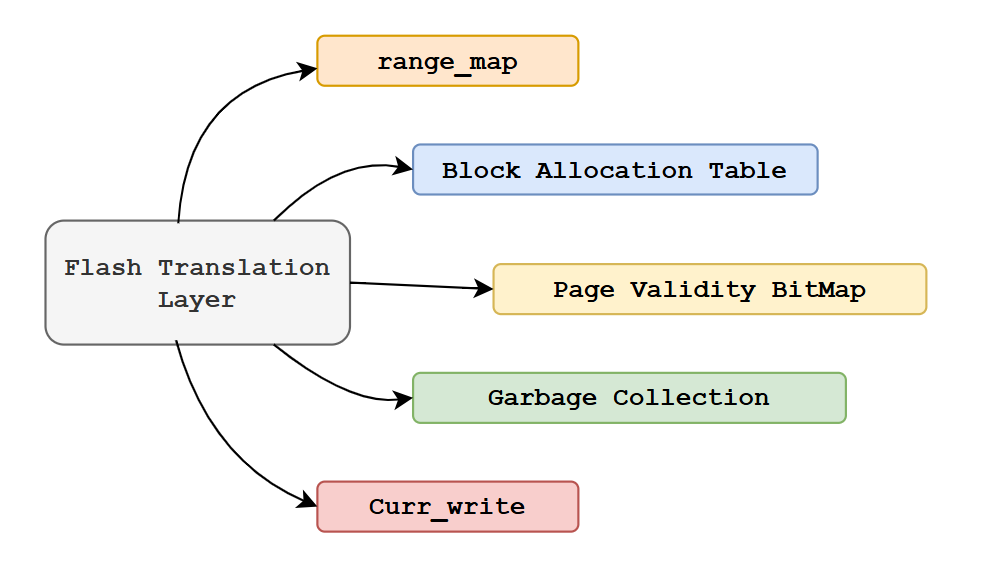

# Flash Translation Layer
## I. Tổng quan
Tổng quan tổ chức các layter của một hệ thống lưu trữ

  

- **Simple-FAT** nằm ở phần Filesystem.
- **FTL** nằm ở Flash Translation Layer.
- **FLASH driver**: AT45DB161_driver để giao tiếp với phần cứng

### 1. Khái niệm
- Một lớp phần mềm nằm giữa Filesystem và flash (phần cứng).  
- FTL ảo hóa địa chỉ lưu trữ, ánh xạ **địa chỉ logic** sang **địa chỉ vật lý** trên flash.  
- Việc ghi/xóa dữ liệu vật lý do FTL đảm nhận, giúp filesystem hoạt động như đang dùng ổ cứng bình thường.

#### Cơ chế ghi dữ liệu
- Flash không thể ghi trực tiếp lên ô đã có dữ liệu; phải xóa toàn bộ block trước.  
- FTL sẽ ghi dữ liệu mới vào page trống, còn page cũ sẽ đánh dấu là **dữ liệu rác (invalid)** → Điều này giúp ghi nhanh hơn và giảm số lần xóa.

#### Wear Leveling
- Mỗi page flash có số lần ghi/xóa tối đa.  
- FTL phân phối việc ghi/xóa đều khắp các page, tránh một số page bị hao mòn quá nhanh, giúp **kéo dài tuổi thọ flash**.

#### Garbage Collection
FTL thu gom các page bị đánh dấu rác trong block, giải phóng không gian và cấp phát lại cho dữ liệu mới.  
Quá trình này thường chạy **ẩn**, không ảnh hưởng trực tiếp đến ứng dụng.

## II. Design FTL
### 1. Các thành phần

  

#### a. range_map
~~~c
typedef struct {
    uint16_t physical_page; // // Vị trí PP trên flash đang giữ mapping table của range này
} Logical_range_t;

Logical_range_t range_map[TOTAL_RANGES]; // Nằm trong struct FTL

range_map[] cho biết: Mapping của range i đang nằm ở physical page nào.
~~~

Trong trường hợp đơn giản, mọi thứ điều nằm ở trên RAM. Để có thể quản lí table ánh xạ từ địa chỉ logical →  physical.
~~~c
uint16_t table[lp]; // với table[lp] = pp 

// lp - logical page, pp - physical page
~~~

Với 4096 logical page →  4096 physical page => Cần 4096 * 2bytes mỗi entry = 8192 = `8KB` RAM. Nếu FTL chạy trên các CPU hiện đại có dung lượng RAM dồi dào thì kích thước này không phải vấn đề lớn.

Nhưng vấn đề sẽ xảy ra nếu chạy trên những MCU, ví dụ: STM32F103C8T6 chỉ có `20KB` RAM. 

FTL đã chiếm gần 1 nữa lượng RAM của MCU chỉ để lưu trữ -> Thiết kế này thật sự là quá tệ. Chưa kể còn phải dành RAM cho những thành phần khác trong hệ thống hoạt động như freeRTOS, drivers, ....

**💡 Giải pháp**: Lưu trữ bản ánh xạ này vào trong flash thay vì trên RAM.

Với 4096 page vật lí -> chia thành 32 range để tiện quản lí
~~~
range index = 0 -> quản lí logical page từ  0 → 127.
range index = 1 -> ... từ 128 → 255.
...
ragne index = 31 -> ... logical 3968 → 4095
~~~
=> Mỗi range sẽ cần 1 physical page lưu trữ trên flash. Ở đây có 32 range nên cần 32 physical page.

Từ đó có thể thấy được `Logical_range_t range_map[TOTAL_RANGES]` có nhiệm vụ và lưu lại page vật lí nào đã chứa các range .

Cấu trúc quản lí cho từng range
~~~c
#define MAP_MAGIC               0x4D50 // 'MP' -> Giúp ta biết được page này chứa dữ liệu mapping

typedef struct __attribute__((packed)) {
    uint16_t magic;                    // Định danh mapping page
    uint16_t range_index;              // Range đang quản lý (0 → 31)
    uint16_t entries[PAGES_PER_RANGE]; // L2P Map: entries[LP] = PP
} mapping_page_t;
~~~

**Cách tra Logical → Physical**   
Ví dụ: App ghi dữ liệu vào logical page = 0

- B1: Xác định range
~~~c
range_index = logical_page / 128 = 0; // logical page này do range 0 quản lí
lp_offset   = logical_page % 128 = 0;
~~~
- B2: Lấy physical page chứa dữ liệu mapping
~~~c
pp_map = range_map[range_index].physical_page;
~~~
- B3: Đọc mapping từ flash
~~~c
mapping_page_t mp;
flash_read_page(pp_map, &mp);
~~~
Lúc này ta có:
~~~
mp.magic       = MAP_MAGIC
mp.range_index = 0
mp.entries[128] // bảng lp -> pp
~~~
- B4: Tra physical page chứa data
~~~c
data_pp = mp.entries[lp_offset];
~~~

#### b. Block Allocation Table
Mỗi block quản lý **8 pages** trong hệ thống
⇒ Với **4096 pages** ⇒ FTL có **512 blocks**.

**💥 Vấn đề**: Làm thế nào để xác định:
> Block nào còn page trống (free)
> Block nào có số lượng page invalid vượt ngưỡng để tiến hành garbage collection.
> Thu hồi lại các physical page đã bị bỏ

**💡 Giải pháp**: Cần có một cấu trúc để quản lí thông tin của từng block
~~~c
typedef struct Block_State{
    uint16_t erase_count;   // Số lần xóa của block
    uint8_t  free_pages;    // Số lượng page free
    uint8_t  invalid_pages; // Số lượng page rác
} Block_State_t;

Block_State_t BlockAllocationTable[TOTAL_BLOCKS]; // Nằm trong FTL
~~~

Dựa trên các thuộc tính của Block_State_t, FTL sẽ quyết định chiến lược quản lý block:
- Nếu `free_pages = 0` -> Block đã đầy, loại khỏi danh sách cấp phát.
- Nếu `invalid_pages > 7` -> Block có nhiều page rác, đưa vào danh sách garbage collection.
- `erase_count` được dùng để lưu số lần block này bị xóa.

#### Page Validity BitMap
Với Block Allocation Table cho biết:
- Block nào còn page trống.
- Block nào có page rác.   
Tuy nhiên, nó không cho biết page cụ thể nào đang free, valid hay invalid trong block.

**💥 Vấn đề**:
> Làm thế nào để xác định chính xác trạng thái của từng page trong một block?

**💡 Giải pháp**: Page Validity BitMap   
Mỗi block sẽ có một `bitmap` để theo dõi trạng thái của 8 page.
~~~c
#define PAGE_STATE_FREE      0x0   // page chưa ghi
#define PAGE_STATE_VALID     0x1   // page đang chứa data hợp lệ
#define PAGE_STATE_INVALID   0x3   // page rác 
~~~
~~~c
typedef union {
  uint16_t raw;
  struct {
    uint16_t page_0: 2;
    uint16_t page_1: 2;
    uint16_t page_2: 2;
    uint16_t page_3: 2;
    uint16_t page_4: 2;
    uint16_t page_5: 2;
    uint16_t page_6: 2;
    uint16_t page_7: 2;
  } pages;
} Bitmap_t;
~~~
Mỗi `page` chiếm `2 bit`. Toàn bộ block chỉ cần `16 bits` để lưu trữ trạng thái.

**Block State Log**        
Mỗi khi có bất kỳ thay đổi trạng thái page trong block, FTL sẽ ghi lại một log:
~~~c
// Nhật kí thay đổi state của block
typedef struct Block_State_Log{ 
  uint16_t  BlockID;
  Bitmap_t  bitMap;
  bool      erase_flag;
} Block_SL_t;
~~~
- `erase_flag`: 
  - = 1: Khi block vừa được dọn rác -> BitMap = 0x0000 (toàn bộ page đều free). Các giá trị log được đó đều vô nghĩa.
  - = 0: Block đang được sử dụng bình thường

- Và các log này có được hợp nhất khi ở trong cùng 1 vùng lưu trữ. Tôi sẽ giải thích sau.

#### Garbage Collection

#### curr_write

### Tham khảo
- https://dthain.github.io/opsys-sp25/project6/