# A Simple Filesystem

## I. Cấu trúc cơ bản
Ở mức cơ bản nhất, mỗi file được tổ chức dưới dạng danh sách liên kết các block. Block là đơn vị nhỏ nhất mà hệ thống có thể thực hiện thao tác read/write.

Kích thước block được tính theo byte, phổ biến là: 512B, 1KB, 2KB, ...  
Trong tài liệu S-FAT, thuật ngữ *sector* sẽ được dùng để chỉ các block có khả năng read/write.

**Ví dụ**: Một file `foo.txt` có kích thước là 1400 bytes được lưu trữ trong một filesystem có kích thước mỗi sector = 512 bytes. Điều gì sẽ xảy ra ?

  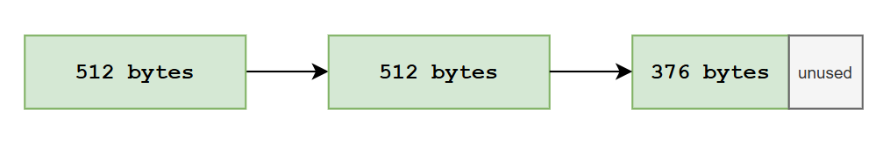

- 2 sector đầu tiên sẽ đầy: 512 * 2 = 1024 bytes.
- Sector thứ 3 sẽ lưu trữ 376 byts, và còn lại 136 bytes không sử dụng.

Hệ thống Filesystem của tôi sẽ dựa trên **FAT (File Allocation Table)**. Và tôi đặt tên cho dự án filesystem này là **Simple-FAT**.

Các thành phần cơ bản của **Simple-FAT**.
- `superblock`: Quản lí toàn bộ thông tin về FAT như sector, size sector, cluster, ...
- `directory area`: Nơi lưu trữ thông tin của file đã được tạo.
- `file allocation table`: Theo dõi các cluster nào đã được sử dụng.
- `data area`: Dữ liệu thực sự của file được lưu trữ ở đây.

  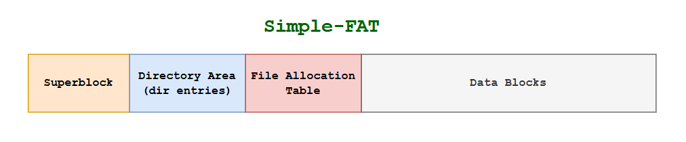

Tiếp tục với ví dụ bên trên, lúc này các thành phần của SFAT sẽ chứa.

**Directory entry**

  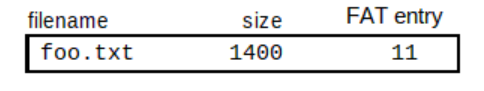

- **filename**: Tên file.
- **size**: Kích thước hiện tại file.
- **FAT-entry**: Chỉ số sector đầu tiên của file trong bảng FAT.

**File Allocation Table**

  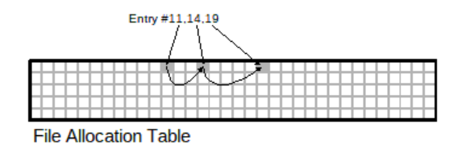

  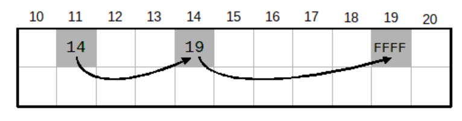

**Data Area**

  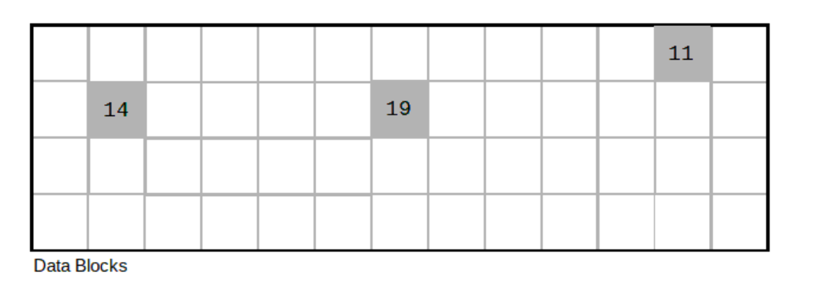

## II. Design filesystem
### 1. Superblock
Superblock là vùng đầu tiên của filesystem, dùng để mô tả toàn bộ layout của filesystem. Mọi thông tin cần thiết để mount và truy cập filesystem đều được lưu trữ tại đây.

Superblock có kích thước là `44 bytes`. Với kích thước như này đủ để quản lí tất cả các thông tin trong filesystem bất kể có bao nhiêu bytes đi chăng nữa.

~~~c
typedef struct SuperBlock
{
  uint16_t total_sectors;         // Total number of sectors
  uint16_t sectors_per_cluster;   // Number of sectors in each block
  uint16_t bytes_per_sector;      // Number of bytes in each sector
  uint16_t available_sectors;     // Number of sectors available
  uint16_t total_direntries;      // Total number of directory entries (files)
  uint16_t available_direntries;  // Number of available dir entries
  uint8_t  fs_type;               // File system type (FA for SFAT)
  uint8_t  reserved[11];          // Reserved, all set to 0
  uint8_t  label[20];             // Not guaranteed to be NUL-terminated
}SuperBlock_t;
~~~

  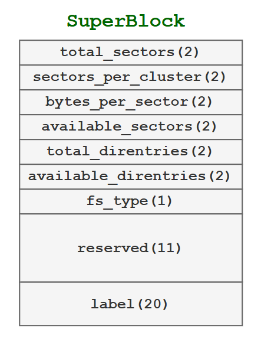

Tổng bytes cho vùng superblock: 44 bytes -> Chiếm 1 sector.

Và ở đây, bạn có thể thắc mắc là cluster là gì?
> Trong filesystem, cluster là đơn vị cấp phát (allocation unit) – tức là đơn vị nhỏ nhất mà hệ thống dùng để cấp phát dung lượng cho file.

Trong Simple-FAT, tôi chọn 1 cluster = 1 sector. Có thể tùy chỉnh hệ thống 1 cluster = 2 sector, ...

### 2. Directory area
Chứa các directory entry, mỗi entry lưu trữ metadata của một file trong hệ thống.

~~~c
typedef struct __attribute__((packed))
{
  uint8_t  name[10];     // Not guaranteed to be NUL-terminated
  int16_t  fat_entry;    // First data block
  uint32_t size;         // Size of the file in bytes
} DirEntry_t;
~~~

  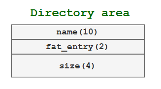

Số lượng tối đa file tối đa của SFAT là: 32 file.   
→ Tổng bytes cần thiết cho vùng này: 32 * 16 = 512 bytes → Chiếm 1 sector.

### 3. File Allocation Table và Data Blocks
- Mỗi fat entry: có kích thước là 2 bytes.
- Số sector Data Area cần quản lý: 4096 - 1 - 1 - 16 = 4078 sector  
→ Cần 4078 FAT entry.

Dung lượng FAT:
4078 × 2 = 8156 bytes < 8192 bytes (16 sector) => FAT sẽ chiếm 16 sectors. 

Sơ đồ bên dưới thể hiện mối quan hệ giữa một **FAT entry** với một **cluster** của Data Area.

  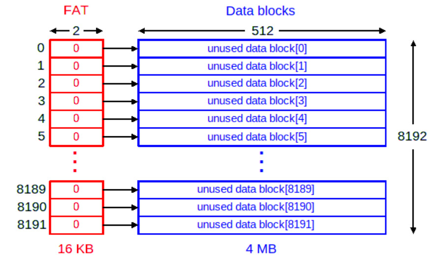

Để hiểu rõ hơn, hãy xem ví dụ sau: Tạo một file `foo.txt` có kích thước 1400 bytes. Hình ảnh dưới đây minh họa cách nội dung file này được biểu diễn trong FAT và Data Block.

  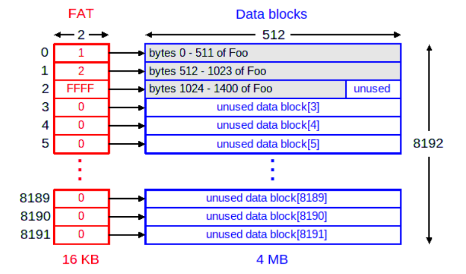

- Giá trị 0 trong FAT entry biểu thị data block chưa được sử dụng (FREE).
- Giá trị 0xFFFF biểu thị kết thúc chuỗi cấp phát của file (EOF).
- Các giá trị khác biểu thị chỉ số fat entry tiếp theo trong chuỗi liên kết của file.

### 4. Tổng quan phân bố sector của các thành phần trong filesystem

  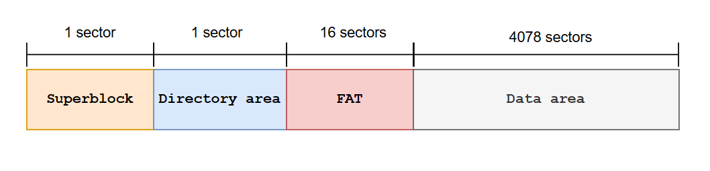

> 📌 **Lưu ý**  
> Các vị trí sector và cluster đều là địa chỉ logic (logical address).  
> Tất cả các thành phần trong hệ thống S-FAT đều làm việc với logical address.

## III. Các thao tác trên filesystem
### 1. Init S-FAT
~~~c
#define SFAT_TOTAL_SECTORS        4096
#define SFAT_SECTORS_PER_CLUSTER  1      // Sectors of per cluster
#define SFAT_BYTES_PER_SECTOR     512    // Bytes of per sector
#define SFAT_MAX_DIRENTRIES       32  // Total number of dir entries

SuperBlock_t superblock = {
    .total_sectors        = SFAT_TOTAL_SECTORS,
    .sectors_per_cluster  = SFAT_SECTORS_PER_CLUSTER,
    .bytes_per_sector     = SFAT_BYTES_PER_SECTOR,
    .available_sectors    = 4078,
    .total_direntries     = SFAT_MAX_DIRENTRIES,
    .available_direntries = 32,
    .fs_type              = 0xFA, // SFAT
    .reserved             = {0},
    .label                = "Simple-FAT"
};
~~~

### 2. Quản lí file
Để có thể quản lí các file đang mở và sử dụng, tôi tạo **File Discriptor Table**.
~~~c
// Cấu trúc của mỗi file entry khi nằm trong table
typedef struct FileDescriptor {
  DirEntry_t *dir_entry;  // Trỏ tới dir entry của file.
  uint32_t    offset;     // vị trí đọc/ghi hiện tại của file.
  uint8_t     mode;       // Chế độ hoạt động khi write
  bool        used;       // Cờ đánh dấu file descriptor đang được sử dụng hay không.
} FD_t;
~~~

### 3. Các thao tác
#### Tạo file
~~~c
int8_t sfat_create(const char *name);

@param name Tên của file
@retval 
- SFAT_OK: Nếu còn chỗ trống.
- SFAT_ERR_NODATA: Không còn chỗ tạo file trong directory area
~~~

#### Xóa file
~~~c
int8_t sfat_delete(const char *name)

@param name Tên của file cần xóa
@retval 
- SFAT_OK: nếu xóa thành công
~~~

#### Mở file
~~~c
int8_t sfat_open(const char *filename, uint8_t mode) 

@param filename Tên của file cần sử dụng
@param mode Chế độ hoạt động
@retval fd của file nếu mở thành công. fd sẽ được lưu trữ trong File Descriptor Table.
~~~

Các mode:
- `SFAT_MODE_W`: Mở file để ghi. Con trỏ ở đầu file. Ghi đè tất cả nội dung đã có.
- `SFAT_MODE_R`: Mờ file chỉ để đọc. Con trỏ read ở đầu file.
- `SFAT_MODE_A`: Mở file để ghi nối tiếp. Con trỏ ghi ở cuối file.
- `SFAT_MODE_RP`: Mở file để đọc và ghi. Con trỏ ở đầu file. Đọc/ghi một cách ngẫu nhiên

#### Ghi file
~~~c
int8_t sfat_write(int fd, const void *buf, uint32_t size)

@param fd Truyền vào fd của file đã mở.
@param buf Nơi lưu trữ dữ liệu.
@param size Kích thước của dữ liệu.
@retval 

- SFAT_ERR_BAD_FD: fd không hợp lệ (file chưa được mở).
- SFAT_ERR_NULL_PTR: buffer = NULL or size = 0.
- SFAT_OK: Khi ghi dữ liệu vào file thành công.
~~~

#### Đọc file
~~~c
uint32_t sfat_read(uint8_t fd, void *buf, uint32_t size)

@param fd file mô tả cùa file đang mở
@param buf Nơi dữ liệu sẽ được lưu trữ khi đọc
@param size Kích thước bytes dữ liệu cần đọc
@retval Tổng số byte đã đọc được

Or
- SFAT_ERR_NOT_OPEN: Lỗi không tìm thấy file đang open.
- SFAT_ERR_BAD_MODE: File không được mở ở chế độ đọc.
- SFAT_ERR_NULL_PTR: buffer = NULL or size = 0.
~~~

#### Đóng và state file
~~~c
void sfat_close(uint8_t fd);

@param fd file mô tả của file cần đóng.
~~~

Trạng thái file của filesystem
~~~c
int sfat_stat(const char *name);

@param name Tên của file cần xem thông tin.
~~~

## IV. Debug

Tham khảo:
- https://azrael.digipen.edu/~mmead/www/Courses/CS180/Simple-FS.html
- https://azrael.digipen.edu/~mmead/www/